# SPM fMRI 数据处理流程指南

> MATLAB 中 SPM 处理具有图像化界面，对新手友好，但自由度较低。本流程为 Rt-me-fmri 论文预处理的起点。

spm使用的是nifti格式，如果是医院采集得到的dicom格式，需要转成.nii.gz格式，一般来讲dicom格式可能是一个文件夹，一层会有一张图像，但nii.gz格式里面可能是一个三D或者4D的数据

数据格式：BIDS(脑成像数据规范)，一般公开数据集上都会整理成这种格式
https://www.bilibili.com/video/BV1zT4y1f75K/?spm_id_from=333.1387.favlist.content.click&vd_source=37f65d61d773c19667d0c962353c67f5

## 1. 数据预处理（基础步骤）

### 1.1 删除前几个体积（Steady State）
为了保持稳态，消除前几个体积的磁场不均衡影响，通常会删除前面几个体积。SPM 不能直接完成此操作，需自行编写 MATLAB 代码实现：

```matlab
% 删除前 6 个体积
num_volumes_to_delete = 6; 
Y(:, :, :, 1:num_volumes_to_delete) = []; 
% 更新头信息
V(1:num_volumes_to_delete) = []; 
% 保存处理后的数据
output_path = 'path_to_save_processed_data.nii'; 
V.fname = output_path; 
spm_write_vol(V, Y);
```

### 1.2 计算平均帧位移（FD, Framewise Displacement）
用于质量控制，评估疾病组与健康组是否存在显著差异，剔除头动过大的 fMRI 数据以提高准确性。

```matlab
% 读取运动参数文件（通常为 .txt 文件）
motion_params = load('path_to_motion_params.txt'); % 替换为实际路径
% 计算 Framewise Displacement (FD)
FD = zeros(size(motion_params, 1), 1);
for t = 2:size(motion_params, 1)
    % 计算每个时间点的平移和旋转运动参数变化
    delta_params = motion_params(t, :) - motion_params(t-1, :);
    % 计算平移运动参数的平方和
    translation_squared = sum(delta_params(1:3).^2);
    % 计算旋转运动参数的平方和并转换为毫米
    rotation_squared = sum((delta_params(4:6) * (50/180 * pi)).^2);
    % 计算 FD
    FD(t) = sqrt(translation_squared + rotation_squared);
end
% 保存 FD 值
save('FD.mat', 'FD');
```
## 2. SPM 标准预处理流程
> 这部分可以参考：https://www.bilibili.com/video/BV19f4y1z71A?spm_id_from=333.788.videopod.sections&vd_source=37f65d61d773c19667d0c962353c67f5

在 MATLAB 命令行输入 spm fmri 打开图形界面。

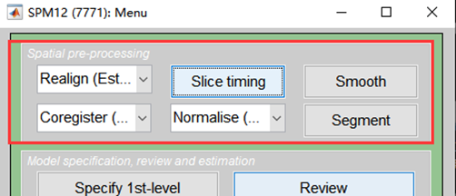
### 2.1 Slice Timing（时间层校正） 
对上某一层
- **Data**: 选择全脑数据（通常为 MRIConvert 转换的 `.img` 文件）。
- **TR / TA**: 在 JSON 文件中查找，或使用 `spm.vol('文件名')` 查看。计算公式：`TA = TR - TR/Slice_num`。
- **Slice order**: 可拷贝 slice timing 顺序。若已知顺序可不填 TA，可自行计算。
- **Reference slice**: 基准层。
- **运行**: 点击绿色三角形运行，完成后使用 `display` 检查。
- **输出**: 生成以 `a` 开头的文件。
- **注**: EPI Interleave 采样模式下 Slice order 通常为 `1:2:32 2:2:32`。TR 以秒为单位。


 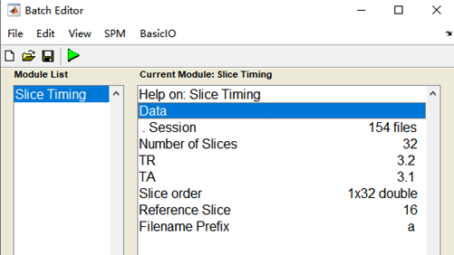

具体做法：Data选择用MRIConvert转换的IMG文件     
TR以秒为单位
Slice order: 1:2:32 2:2:32 （由于EPI的Interleave采样模式）  

TA=TR-TR/Slice_num

`会在原来影像的文件夹中生成以a开头的文件名，即时间配准后的图像`

### 2.2 Realign（Est&Res）（计算头动校正参数并改写图像）
> **核心功能**：计算被试扫描过程中的头部运动参数，并据此重采样（移动）图像，消除头动对信号的影响。

- **三种模式对比**：
  - `Estimate`：仅计算并记录头动参数，**不移动图像**，不生成新文件（仅更新原始数据头文件信息）。
  - `Reslice`：仅根据已有参数**移动/重采样图像**。
  - **`Estimate & Reslice`**：同时计算参数并移动图像，将所有时间点对齐到参考图像。**✅ 一般直接选用此选项。**

- **关键参数设置**：
  - **Data**：选择时间校正后的数据。输入匹配模式 `^a.*run-1.*` → 右键 `Select All`。若不清楚总时间点数，可输入 `1:1000`（本论文实际为 210 个时间点）。
  - **Num passes**：默认 `Register to mean`（逐帧匹配到平均图像）；也可改为 `Register to first`（逐帧匹配到第一张图像）。
  - **其他参数**：保持默认即可（若不确定具体含义，请勿随意修改）。

- **输出文件说明**：
  - 生成前缀为 `r` 的图像文件（如 `ra*.nii`）。
  - 生成 `rp_*.txt` 文本文件：记录 **6 个头动参数**（3个平移 x/y/z，3个旋转 pitch/roll/yaw）。该文件后续将作为协变量（nuisance regressors）输入一般线性模型（GLM）进行回归校正。

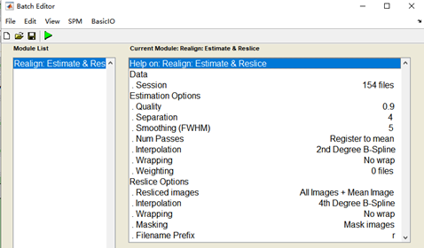
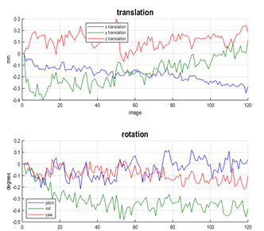
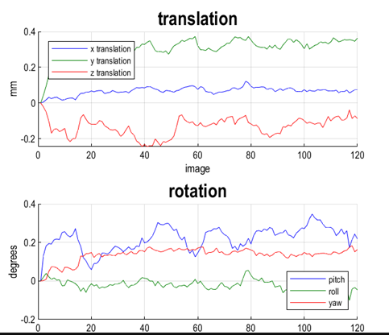

### 数据选择提示
- **Data**：选择 Slice Timing 后的文件（以 `a` 开头），输入匹配模式 `^a.*` → 右键 `Select All`，其他参数保持默认。


### 空间配准（Coregister）原理
- **核心流程**：功能像 → 结构像配准 → 结构像 → 标准空间配准。
- **核心操作**：将计算得到的配准矩阵统一应用到所有功能像上。
- **最终结果**：所有功能像均被配准至标准空间。
- **注意事项**：功能像应尽量保持不动，避免多次重采样引入插值误差。

 

#### 🔹 Coregister: Estimate（仅计算配准矩阵）
- **功能**：仅计算空间变换矩阵，**不生成新图像**。计算完成后可在 `Display` 窗口叠加查看配准效果。
- **参数设置**：
  - `Reference Image`：结构像（T1）。
  - `Source Image`：功能像（建议使用头动校正后的平均像 `mean*.nii` 作为代表，用于计算矩阵并应用到其他图像）。
  - `Other Images`：剩余功能像（输入 `^ra.*`）。

#### 🔹 Coregister: Reslice（图像重采样）
- **功能**：根据已有矩阵对图像进行空间重采样或分辨率调整。
- **参数设置**：
  - `Image defining space`：定义目标空间/体素大小的参考图像（相当于模板）。
  - `Image to reslice`：选择需要改变大小或进行重采样的图像。

### 空间标准化（Normalise: Estimate & Write）
> **说明**：此步骤将个体脑图像映射至标准模板空间（如 MNI 空间）。
- `Image to align`：选择结构像（T1），用于计算到标准空间的形变场/配准参数。
- `Image to Write`：选择需要标准化的功能像（文件较多，运行耗时较长，通常匹配 `^ra.*`）。
- **其他参数**：保持默认即可。

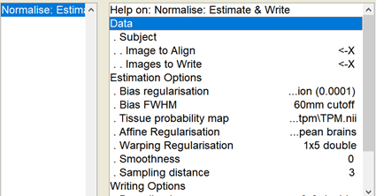

结构→功能，结构→标准空间
Normalise

### 2.3 Coregister (Estimate)
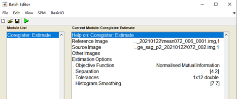
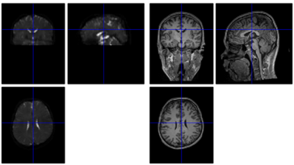
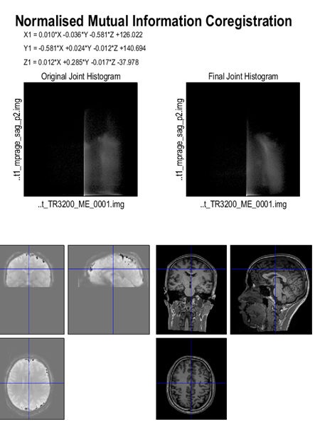
 
- **Reference Image**：选择头动校正后的平均功能像（`mean*.nii` 开头）。
- **Source Image**：选择 T1 结构像（`t1_mprage`）。
- **其他参数**：保持默认（具体配置参考上方配图）。
- **说明**：此步骤仅计算空间变换矩阵，不生成新图像。计算完成后可在 `Display` 窗口中查看配准叠加效果。功能像尽量保持不动，以避免多次重采样引入插值误差。

---

### 2.4 Segment 分割为灰质，白质，脑脊液

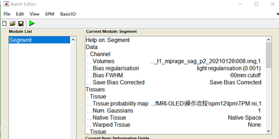 
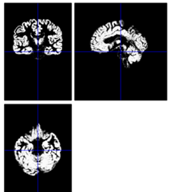

- **Volumes**：选择配准后的结构像（T1 图像）。
- **Options**：
  - `Save Bias Corrected`：勾选 `Save Bias Corrected`
  - `Deformation Fields`：选择 `Forward`
- **说明**：将结构像分割为灰质（GM）、白质（WM）和脑脊液（CSF）。此步骤涉及非线性形变场计算，运行耗时较长。

---
### 2.5 Normalise (Write) 功能项  标准化
 
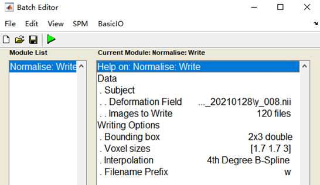

- **Deformation Field**：选择 T1 目录下以 `y` 开头的形变场文件（由 Segment 步骤生成）。
- **Images to Write**：选择 BOLD 目录下以 `ra` 开头的功能像文件。
- **Voxel sizes**：`[1.7 1.7 3]`
- **输出**：生成前缀为 `w` 的标准化功能像。

---
### 2.6 Normalise (Write) 结构项

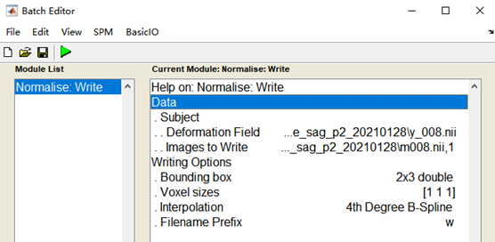

- **Deformation Field**：同上，选择 T1 目录下以 `y` 开头的形变场文件。
- **Images to Write**：选择 T1 目录下以 `m` 开头的文件（偏置校正后的结构像）。
- **Voxel sizes**：`[1 1 1]`
- **其他参数**：保持默认（参考配图）。

---
### 2.7 Smooth
空间平滑 wr开头
FWHM   前缀是s  kernel大小，是立体图像  会更模糊

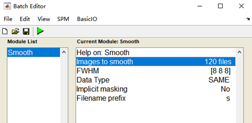
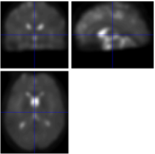

- **Images to smooth**：选择 BOLD 目录中已完成标准化的功能像（以 `wra` 开头）。
- **FWHM**：设置高斯平滑核大小（单位：mm）。平滑为三维立体卷积，处理后图像会变得更模糊，文件前缀变为 `s`（如 `swra*.nii`）。
- **说明**：空间平滑可提高信噪比，并使数据更符合高斯随机场理论（RFT）的统计假设。

---


## 3. 一般线性模型（GLM）分析：被试水平（1st-level）

### 3.1 Specify 1st-level（定义模型）

- **Directory**：新建目录用于存储模型文件（可在命令行使用 `mkdir 1st_level`）。
- **Units for design**：选择 `Seconds`（秒）。
- **Interscan interval**：输入 TR 值（如 `3.2`）。
- **Scans**：选择预处理后的 fMRI 文件（以 `swra` 开头）。
- **Data & Design**：
  - `Condition`：输入任务/条件名称。
  - `Onsets`：填写每次任务态开始的时间点（如 `12 60 372`）。
  - `Durations`：填写任务态持续时间（如 `30`）。
  - `Multiple regressors`：选择 BOLD 目录下的头动参数文件（`rp_*.txt`，以 `r` 开头）。
  - *注*：`Microtime resolution` 与 `Microtime onset` 通常无需修改。
- **输出**：运行完成后在当前目录生成 `SPM.mat` 文件。


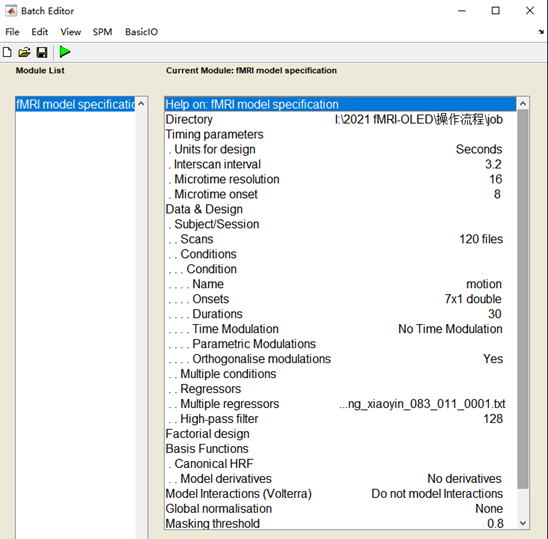

Directory：选择存储模型的目录（工作目录下创建一个）
Scans：用来分析的fmri文件，预处理后的，以swra开头
Units for design：Seconds（以秒为单位）
Interscan interval：3.2（TR长度）
Microtime resolution：不用管
Microtime onset：不用管
Data &Design里面
Onsets：每次任务态开始的时间（12:60:372）
Durations：任务态持续时间（30）
Multiple regressors：选择bold目录下，r开头文件  头动参数

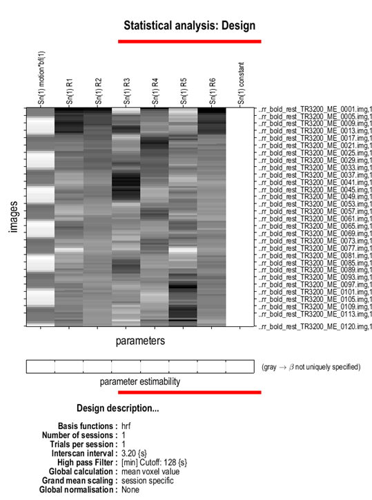

### 3.2 Estimate（参数估计）
- 选择上一步生成的 `SPM.mat` 文件。
- **说明**：运行模型计算，求解各条件的权重参数（β 值）。
 
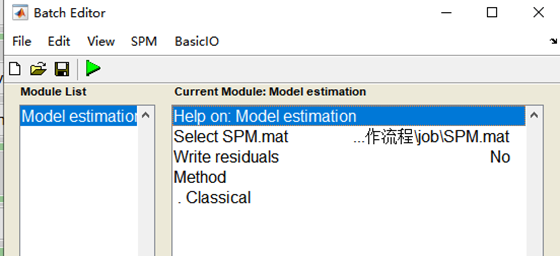

选择job目录下，SPM.mat文件
### 3.3 Results（结果查看与对比）
选择job目录下，SPM.mat文件
选择t-contrasts
选择Define new contrast

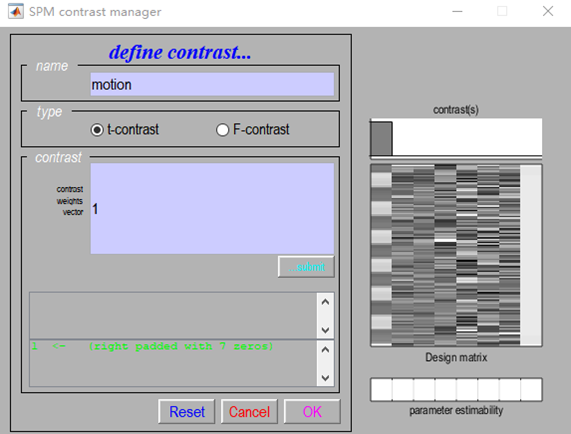
       看第一个条件
- 选择 `SPM.mat` 文件。
- 进入 `t-contrasts` → 点击 `Define new contrast`。
- 设置对比条件（例如查看第一个任务条件）。
- 点击 `OK` → 点击 `Done`，生成统计参数图（t-map）。
- **阈值与参数设置**：
  - `apply masking`：`none`
  - `P value adjustment`：`FWE`，阈值设为 `0.001`（若实验信号较弱或不鲁棒，可尝试 `0.05` 或 `none`）。
  - `Extent threshold (Voxels)`：`0`（忽略小于该体素数的聚类/Cluster）。
- **结果解读**：个体水平分析主要反映单个被试在任务态（ON）与静息态（OFF）块之间的脑区激活差异。
 
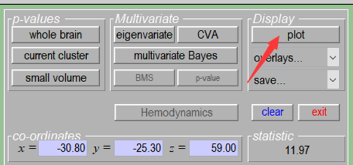 
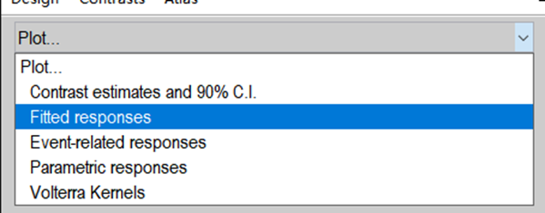  
 
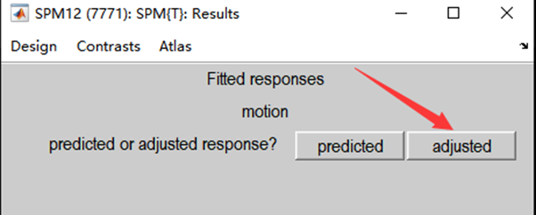
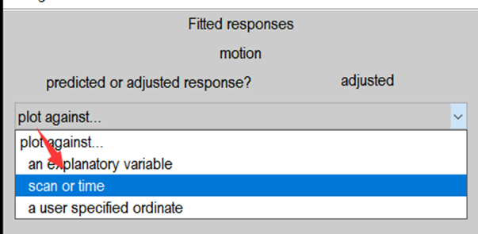

得到结果：
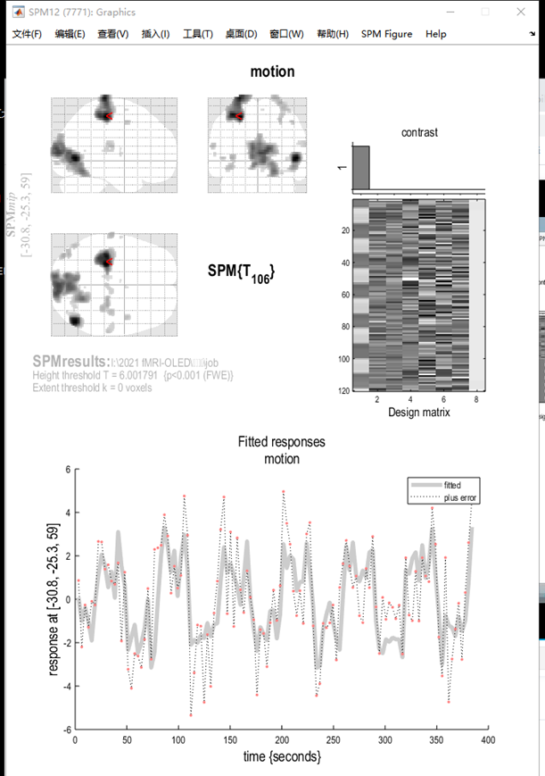
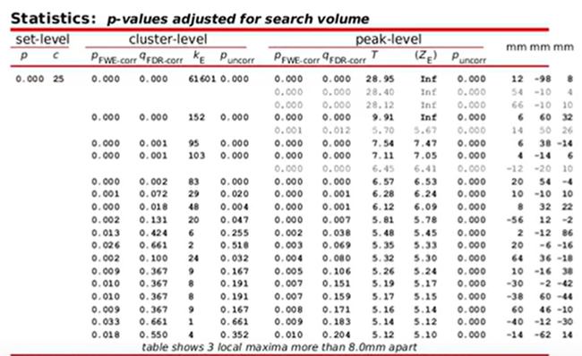

个体水平分析：ON/OFF块的区别

组水平分析，一组人同时ON或OFF的区别
Specify 2nd-level

实验设计里面的数据不是选择脑子的那个文件，而是前面个体水平分析写好的条件，比如运动态减去静息态得到的con_00001.nii文件，每个受试者都选择这个对应的文件，填入协变量的参数（受试者的分类？？


将上述操作导出为代码，就可以些成批处理格式了

要是自己做的预处理效果不好，可以上官网上看看已经做好预处理的数据，公开数据集大概率会有，可以直接下载